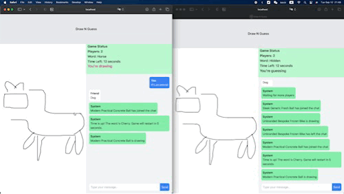

# draw-n-guess
A Draw and Guess game to be used as Azure SignalR service example.

Demo by [Kevin Lee](https://github.com/kevinleeex)🐼, [Jacy Gao](https://github.com/jacygao), [Github Copilot](https://copilot.github.com/)🤖, [ChatGPT](https://chat.openai.com)💬

> Please note that the code in this repository is for **demonstration purposes only**. It was developed in a couple of hours to showcase how to use Azure SignalR service to build a real-time application in a fast and easy way. It is not production-ready and is not intended to be used in a production environment. Use at your own risk.

## Preview


## Installation

### Prerequisites

**Required**
- [Node.js](https://nodejs.org/en/download/)
- [.NET](https://dotnet.microsoft.com/en-us/download/dotnet/6.0)

**Optional**
- [Azure Functions Core Tools](https://docs.microsoft.com/en-us/azure/azure-functions/functions-run-local#v2) - To develop and run Azure Functions locally
- [Azurite](https://learn.microsoft.com/en-us/azure/storage/common/storage-use-azurite?tabs=visual-studio) - To emulate Azure Storage locally
- [Azure SignalR Local Emulator](https://github.com/Azure/azure-signalr/blob/dev/docs/emulator.md) - To emulate Azure SignalR service locally


## Structure

### signalr

This is the SignalR service in serverless mode developed with Azure Functions. It uses the Azure SignalR service to manage the connections and the messages between the clients.

Techs used:
- [Azure Functions](https://learn.microsoft.com/en-us/azure/azure-functions/functions-overview?pivots=programming-language-csharp)
- [Azure SignalR service](https://learn.microsoft.com/en-us/azure/azure-signalr/signalr-overview)
- [Azure SignalR Management SDK](https://github.com/Azure/azure-signalr/blob/dev/docs/management-sdk-guide.md)

### web

This is the web client developed with React. It uses the Azure SignalR service to connect to the SignalR service and send and receive messages.

Techs used:
- [React.js](https://reactjs.org/)
- [SignalR.js](https://docs.microsoft.com/en-us/aspnet/core/signalr/javascript-client?view=aspnetcore-6.0)
- [Tailwind.css](https://tailwindcss.com/)


## Setup

1. Clone the repository

```bash
git clone https://github.com/kevinleeex/draw-n-guess.git
```

2. Prepare the SignalR service for local development

2.a Run Azure SignalR service with emulator mode

We need to install the Azure SignalR service emulator to run the SignalR service locally since we are developing with Azure Functions. (serverless mode)

```bash
cd signalr
dotnet tool install  -g Microsoft.Azure.SignalR.Emulator
# or update if you already have it installed
dotnet tool update -g Microsoft.Azure.SignalR.Emulator
```

Then run the emulator

```bash
asrs-emulator start
```

> There is already a settings.json file in the signalr folder with the configuration to connect to the emulator. In case the file is not existing, you can create it with the following command:

```bash
asrs-emulator upstream init
```

It inits a default settings.json into the current folder, with a default upstream UrlTemplate as http://localhost:7071/runtime/webhooks/signalr, which is the URL for SignalR's local function trigger:

```json
{
  "UpstreamSettings": {
    "Templates": [
      {
        "UrlTemplate": "http://localhost:7071/runtime/webhooks/signalr",
        "EventPattern": "*",
        "HubPattern": "*",
        "CategoryPattern": "*"
      }
    ]
  }
}
```

see [azure-signalr-emulator](https://github.com/Azure/azure-signalr/blob/dev/docs/emulator.md) for more details.

2.b Configure the Endpoint in the local.settings.json for Azure Functions

We also configured CORS to allow the web client to negotiate with the SignalR service.

```json
{
  "IsEncrypted": false,
  "Values": {
    "AzureWebJobsStorage": "UseDevelopmentStorage=true",
    "FUNCTIONS_WORKER_RUNTIME": "dotnet-isolated",
    "AzureSignalRConnectionString": "Endpoint=http://localhost;Port=8888;AccessKey=ABCDEFGHIJKLMNOPQRSTUVWXYZ0123456789ABCDEFGH;Version=1.0;"
  },
  "Host": {
    "LocalHttpPort": 7071,
    "CORS": "http://localhost:3000",
    "CORSCredentials": true
  },
  "ConnectionStrings": {}
}
```

2.c Run Azure Functions with Azure SignalR service

Install the Azure Functions Core Tools to run the Azure Functions locally.
See [Azure Functions Core Tools](https://learn.microsoft.com/en-us/azure/azure-functions/functions-run-local?tabs=macos%2Cisolated-process%2Cnode-v4%2Cpython-v2%2Chttp-trigger%2Ccontainer-apps&pivots=programming-language-csharp#install-the-azure-functions-core-tools) for more details.

Install and start the Azurite to emulate Azure Storage locally.

```bash
npm install -g azurite
azurite
```

Start the Azure Functions

```bash
func start
```

3. Prepare the web client

3.a Install the dependencies

```bash
cd web
npm install
```

3.b Configure the SignalR service endpoint

Edit the config.js file in the `web/src`` folder and change the endpoint to the Azure Functions endpoint.

```javascript
export const SIGNALR_BASE_URL = 'http://localhost:7071/api/';
```

4. Run the web client

```bash
npm start
```

It will start the web client on http://localhost:3000

## Deploy

### Deploy the Azure Functions

see [Deploy Azure Functions](https://learn.microsoft.com/en-us/azure/azure-functions/functions-develop-vs?tabs=in-process#publish-to-azure)

### Deploy the Azure SignalR service

see [Deploy Azure SignalR service](https://docs.microsoft.com/en-us/azure/azure-signalr/signalr-quickstart-azure-functions-csharp#deploy-azure-signalr-service)

Once deployed, you need to updaye the upstream URL in the settings of the Azure SignalR service. See [upsteam settings](https://learn.microsoft.com/en-us/azure/azure-signalr/concept-upstream#configure-upstream-endpoint-settings-via-the-azure-portal) for more details.

Then you need to update the Azure Functions endpoint in the web client.


## Issues & To-Dos

- [ ] Fix the issue that the drawing is not smooth
- [ ] Better UI
- [ ] A logo
- [ ] Keep drawing when resizing the window
- [ ] Add rooms
- [ ] Add a score system
- [ ] Add tips for the guesse
- [ ] *Add AI to generate image based on the sketch
- [ ] *Add AI player


## Contributing

Pull requests are welcome. For major changes, please open an issue first to discuss what you would like to change.

## License

[MIT](./LICENSE)
